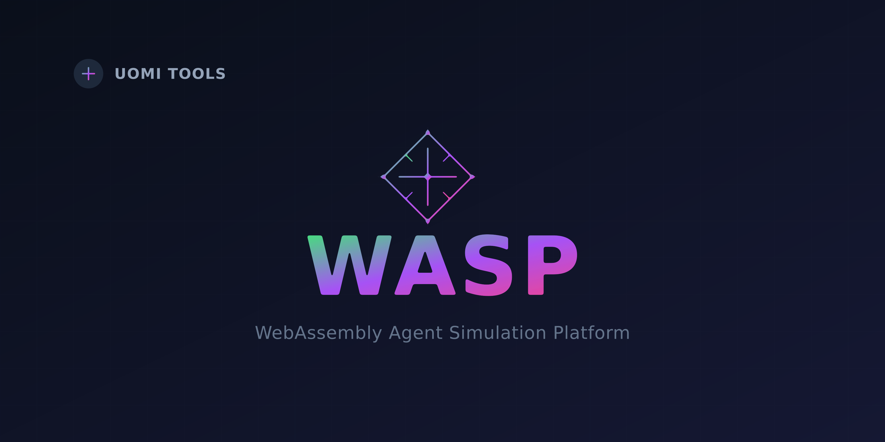

# 🚀 WASP

<div align="center">




[](https://www.rust-lang.org/)
[](https://webassembly.org/)
[](https://nodejs.org/)

*A powerful development environment for creating UOMI agents using WebAssembly and Rust* 🦀

</div>

## 📖 Overview

This development environment allows you to create, test, and debug UOMI agents using WebAssembly (WASM) and Rust. The environment provides seamless integration with both UOMI and third-party LLM services, supporting multiple model configurations and API formats.

### 🌟 Features

- 🔄 Hot-reloading development environment
- 📝 Interactive console for testing
- 🐛 Built-in debugging capabilities
- 🔍 Response analysis tools
- 💾 Conversation history management
- 🔌 Support for multiple LLM providers
- 🔑 Secure API key management
- 📊 Performance metrics tracking

## 🛠 Prerequisites

Before you begin, ensure you have the following installed:

- [Rust](https://rustup.rs/) (latest stable version)
- [Node.js](https://nodejs.org/) (v14 or higher)
- WebAssembly target: `rustup target add wasm32-unknown-unknown`

## 🚀 Getting Started

### Option 1: Quick Start with NPX

```bash
# Create a new UOMI agent project
npx wasp create
```

### Option 2: Manual Setup

```bash
git clone https://github.com/Uomi-network/uomi-chat-agent-template.git
cd uomi-chat-agent-template/agent
npm install
chmod +x ./bin/build_and_run_host.sh
npm start
```

## 🔧 Configuration

### Model Configuration

The environment supports multiple model configurations through `uomi.config.json`:

```json
{
  "local_file_path": "path/to/input.txt",
  "api": {
    "timeout_ms": 30000,
    "retry_attempts": 3,
    "headers": {
      "Content-Type": "application/json",
      "Accept": "application/json",
      "User-Agent": "UOMI-Client/1.0"
    }
  },
  "models": {
    "1": {
      "name": "Qwen/Qwen2.5-32B-Instruct-GPTQ-Int4"
    },
    "2": {
      "name": "gpt-3.5-turbo",
      "url": "https://api.openai.com/v1/chat/completions",
      "api_key": "your-api-key-here"
    }
  },
  "ipfs": {
    "gateway": "https://ipfs.io/ipfs",
    "timeout_ms": 10000
  }
}
```

you can run the node-ai service following this repository [node-ai](https://github.com/Uomi-network/uomi-node-ai)

doing that you don't need to specify any url/api_key in the models configuration, you will run the production version of the node-ai service.

if you don't have enough resources to run the node-ai service you can use a third-party service like openai, in this case you need to specify the url and the api_key in the models configuration.

### Response Formats

The environment automatically handles different response formats:

#### UOMI Format
```json
{
  "response": "Hello, how can I help?",
  "time_taken": 1.23,
  "tokens_per_second": 45,
  "total_tokens_generated": 54
}
```

#### OpenAI Format
```json
{
  "choices": [{
    "message": {
      "content": "Hello, how can I help?"
    }
  }],
  "usage": {
    "total_tokens": 150,
    "prompt_tokens": 50,
    "completion_tokens": 100
  }
}
```

## 💡 Usage Examples

### Interactive Mode
```bash
$ npm start
UOMI Development Environment
Type your messages. Use these commands:
/clear - Clear conversation history
/history - Show conversation history
/exit - Exit the program

You: Hello, how are you?
Assistant: Hello! I'm doing well, thank you for asking...

Performance Metrics:
- Time taken: 1.20s
- Tokens/second: 45
- Total tokens: 54
```

### Development

#### Custom Model Integration
```rust
// Add a new model in uomi.config.json
{
  "models": {
    "3": {
      "name": "custom-model",
      "url": "https://api.custom-provider.com/v1/chat",
      "api_key": "your-api-key"
    }
  }
}
```

## 📊 Performance Monitoring

The environment provides detailed performance metrics:

- Response time tracking
- Token usage statistics
- Rate limiting information
- Error tracking and retry statistics

## 🔐 Security

- API keys are stored securely in configuration files
- Support for environment variable substitution
- Automatic header management for authentication
- Secure HTTPS communication

## 🐛 Debugging

Built-in debugging features:
- Detailed WASM logging
- Request/response inspection
- Performance profiling
- Error tracing with retry information

## 📚 API Reference

### Host Functions

| Function | Description |
|----------|-------------|
| `get_input()` | Read input data |
| `set_output()` | Set output data |
| `call_service_api()` | Make API calls with retry support |
| `get_file_from_cid()` | Fetch IPFS content |
| `log()` | Debug logging |

## Compiled WASM

The compiled WASM file after thest is located in the `host/src/agent_template.wasm` directory.

## 🤝 Contributing

Contributions are welcome! Please feel free to submit a Pull Request.

---

<div align="center">
Made with ❤️ by the UOMI team
</div>